---

**Focus:** `SOC` `SIEM` `VAPT` `DFIR` `Threat Detection` `Network Security`

---

## 🛡️ Cybersecurity Focus

- Security Operations & SOC
- SIEM & Log Analysis
- Vulnerability Assessment & Penetration Testing
- Threat Detection & Analysis
- Incident Response & DFIR
- Network Security & Monitoring
- Web Application Security
- Security Frameworks & Methodologies

---

## 🔧 Security Tools & Technologies

**SOC / SIEM**

`Wazuh` `ELK Stack` `TheHive` `Velociraptor`

**Network Security**

`Zeek` `Wireshark` `Nmap` `Scapy`

**VAPT / Application Security**

`Burp Suite` `Nessus` `Metasploit` `OpenVAS` `OWASP ZAP` `WebGoat`

**Threat Intelligence**

`VirusTotal` `MITRE ATT&CK`

**Systems & Cloud**

`Linux` `Windows` `AWS` `Git` `GitHub`

**Programming**

`Python` `Java` `JavaScript` `HTML` `CSS` `MySQL`

---

## 💼 Cybersecurity Experience

### SOC Intern — CyArt Tech LLP
**February 2026 – July 2026**

- Worked on security monitoring, log analysis, threat detection, and incident investigation.
- Deployed and configured Wazuh and ELK Stack for centralized security event monitoring.
- Worked with TheHive and Velociraptor for incident response, case management, endpoint visibility, and DFIR investigations.
- Configured Zeek for network security monitoring.
- Performed network analysis and vulnerability assessment using Wireshark, Nmap, Scapy, and OpenVAS.

### VAPT Intern — Solosecurities
**June 2025 – August 2025**

- Conducted VAPT assessments using Burp Suite, Nmap, Nessus, and Metasploit.
- Identified and documented network and web application vulnerabilities.
- Supported threat analysis and incident response activities.
- Recommended mitigation strategies to improve security posture.

### Cybersecurity Intern — The Red Users

- Analyzed security logs using SIEM tools for threat detection and incident response.
- Worked with network security analysis using Wireshark and firewalls.
- Performed web application vulnerability assessments using OWASP ZAP and WebGoat.

---

## 📚 Security Frameworks

`MITRE ATT&CK` `NIST` `OWASP` `ISO 27001` `CVSS`

---

## 🎓 Education

**B.Tech — Computer Engineering (Cybersecurity)**  
Symbiosis Skills and Professional University, Pune

**CGPA:** 8.5  
**Expected Graduation:** 2026

---

## 📜 Certifications & Training

- CompTIA Security+ — In Progress
- Cisco Networking Academy — Python Essentials 1 & 2
- Cisco Networking Academy — JavaScript Essentials
- AWS Labs — Getting Started with Compute
- Git & GitHub Bootcamp

---

## 🔍 What I'm Working Toward

Building practical cybersecurity expertise through hands-on work in:

**SOC → Threat Detection → Incident Response → VAPT → DFIR**

---

## 🤝 Connect With Me

- LinkedIn: [LinkedIn](https://www.linkedin.com/in/poojagupta01062004/)
- Email: `gkpooja321@gmail.com`

---

> *Security is not just about finding vulnerabilities — it's about understanding,
> investigating, and reducing risk.*
